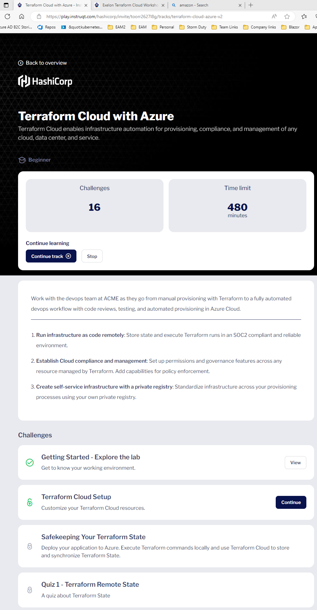
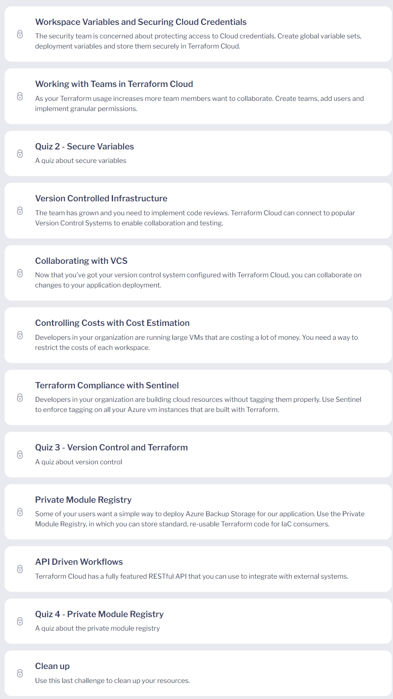
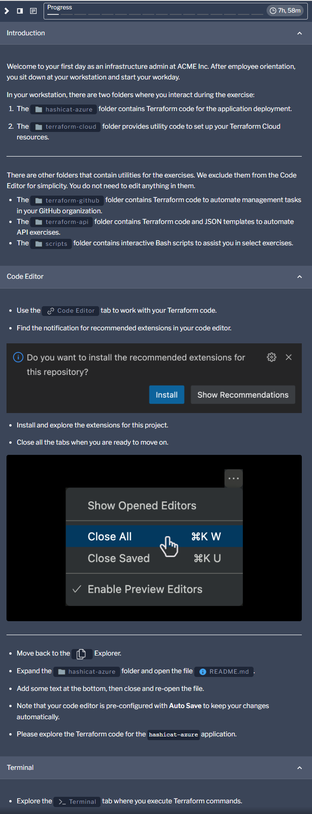
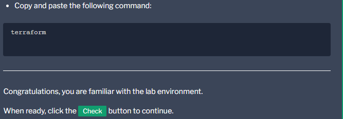
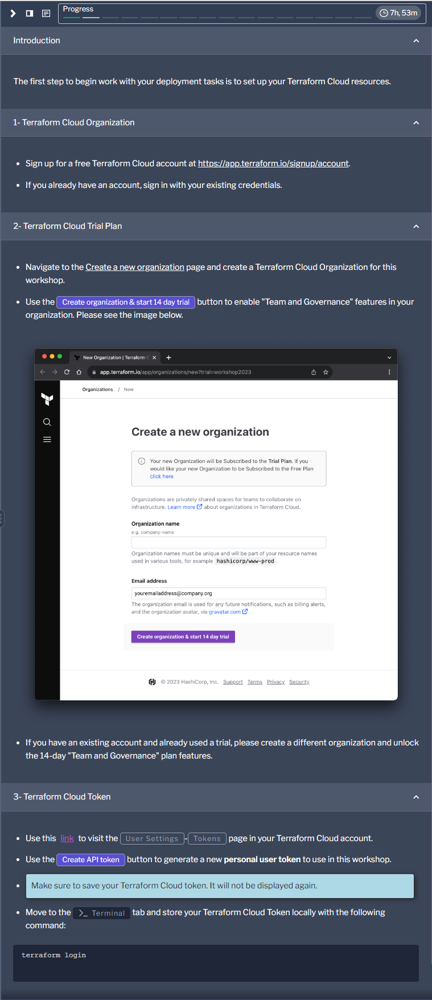
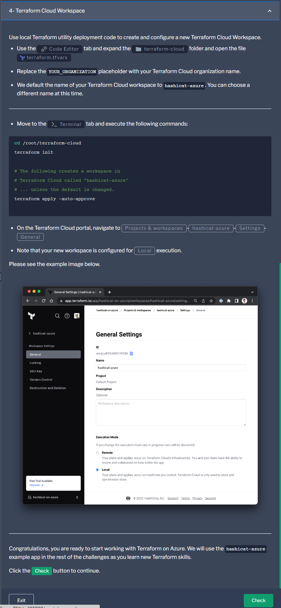
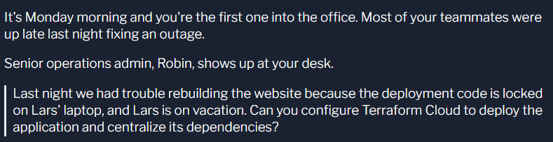
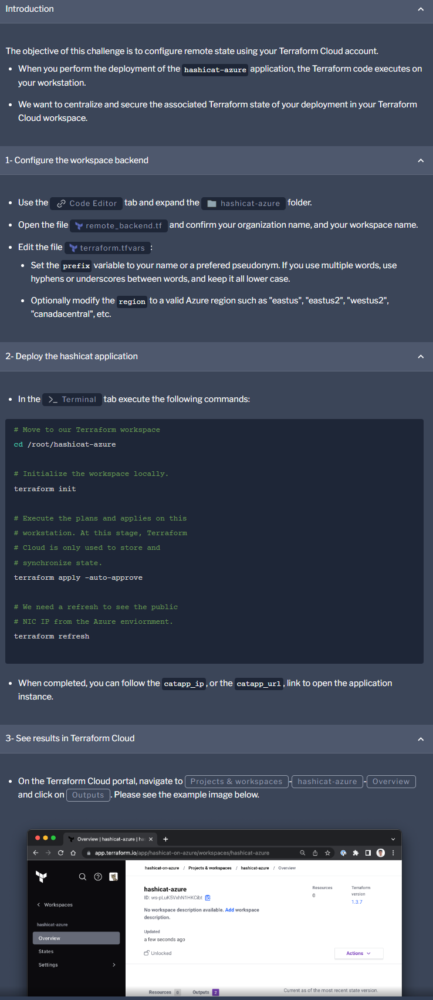
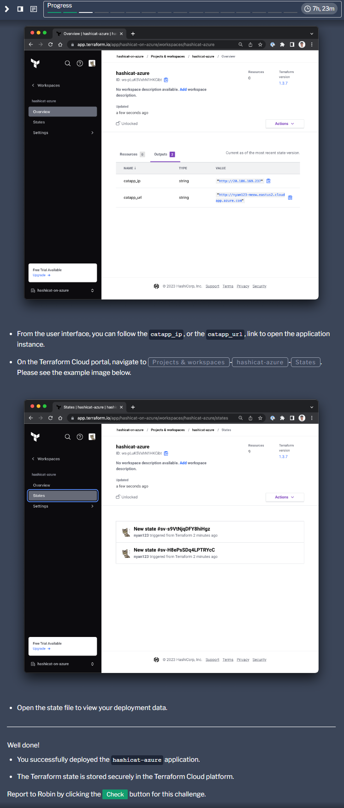

# Terraform Cloud with Azure
Terraform Cloud enables infrastructure automation for provisioning, compliance, and management of any cloud, data center, and service.

Work with the devops team at ACME as they go from manual provisioning with Terraform to a fully automated devops workflow with code reviews, testing, and automated provisioning in Azure Cloud.

1. Run infrastructure as code remotely: Store state and execute Terraform runs in an SOC2 compliant and reliable environment.

2. Establish Cloud compliance and management: Set up permissions and governance features across any resource managed by Terraform. Add capabilities for policy enforcement.

3. Create self-service infrastructure with a private registry: Standardize infrastructure across your provisioning processes using your own private registry.

### hashicat-azure output
Hashicat: A terraform built application for use in Hashicorp workshops.

Includes the "Meow World" website. 😻

# Getting Started - Explore the lab
Get to know your working environment.

# Terraform Cloud Setup
Customize your Terraform Cloud resources.

### With your Terraform Cloud account

1. Create a new Terraform Cloud Organization
2. Enable 30-day Trial Plan of "Team & Governance" features
3. Create a new personal account token
4. Create a dedicated workspace

# Safekeeping Your Terraform State
Deploy your application to Azure. Execute Terraform commands locally and use Terraform Cloud to store and synchronize Terraform State.

